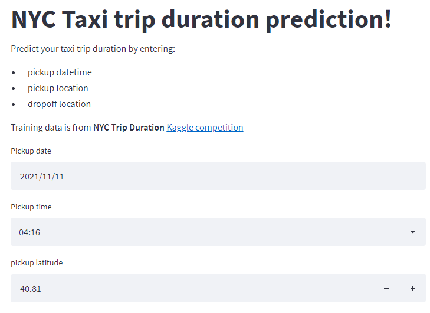
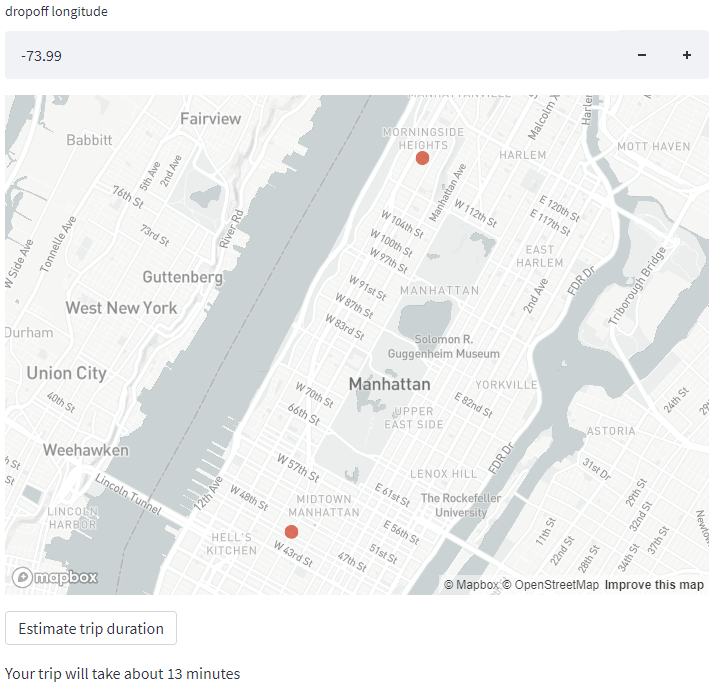

# NYC Taxi trip duration prediction web app

The web-app is developed using the streamlit package and is deployed at https://nyc-cabs-streamlit.herokuapp.com/

The machine learning model, HistGradientBoostingRegressor, is trained from the data from this [Kaggle competition](https://www.kaggle.com/c/nyc-taxi-trip-duration). The prediction target in training is the logarithm of trip durations in seconds. 

*Training error:*
RMSE of log(trip_duration) ~= 0.334

*Validation error:*
RMSE of log(trip_duration) ~= 0.350

When making predictions, the predictions are converted back to seconds.

Inspired by: [Data professor](https://www.youtube.com/c/DataProfessor)

